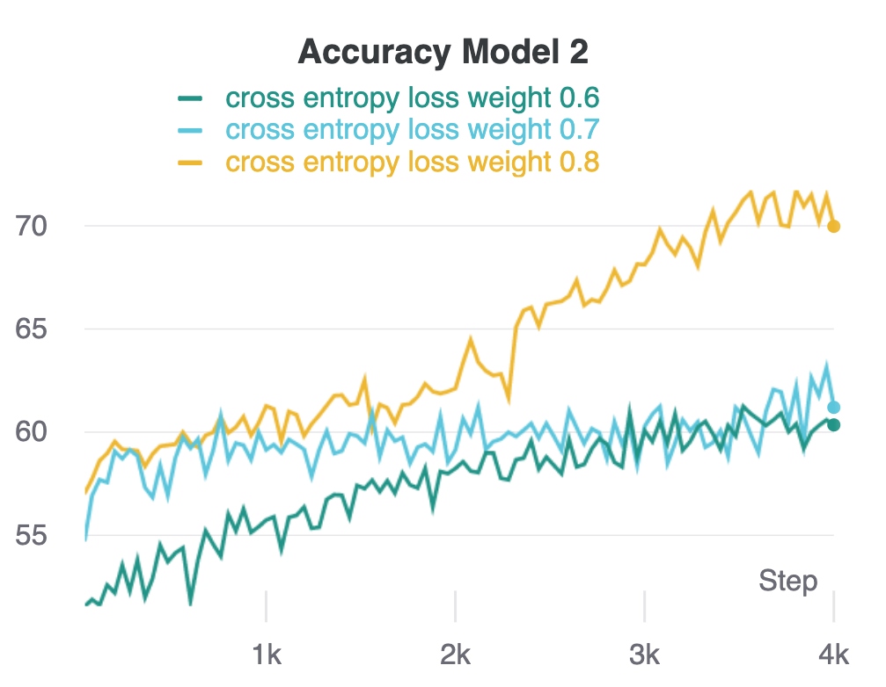

# Thesis

## Introduction
Adversarial Architecture for Network Separation

implementing adversarial architecture to push two networks apart, in order to increase network variance.

<p align="center">

</p>

## Getting Started

### Creating The Environment

We use [conda](https://docs.conda.io/en/latest/) for creating the environments.  

PyTorch version is  1.7.1 
### wandb

We use [wandb](wandb.ai) for visualizing the experiments. For setting everything up, this section needs to be performed (once, like building the enviroment). 

 
[login](https://app.wandb.ai/login) online to wandb. I used the option of *login with Google* and my user is [danielafrimi](https://wandb.ai/danielafrimi).

Then, in the environment containing wandb, run `wandb login`.

### Clone The Repo

```shell
git clone git@github.com:danielafrimi/Thesis.git <REPO-PATH>
```

### Running The Experiments

#### Prerequisites

SSH to the machine on which you want to run the experiment. Then, cd into the repository directory
```shell
cd <REPO-PATH>
```

Activate the relevant environment you created previously (depending on which GPU you are using), e.g.
```shell
conda activate thesis_env
```

The package wandb needs to write some files during running, and by default it writes it to `~/.config/wandb`. While training on a remote machine this path might be in accessible for writing, so we need to change it by running:
```shell
export WANDB_CONFIG_DIR=/PATH/ACCESSIBLE/FROM/REMOTE/MACHINE/.config/wandb/
```

Now run the experiment you want. Each run will log to wandb, as well as to a local log-file (in some predefined directory which defaults to `./experiments`).

#### Example Command-lines

See help for the different possible arguments
```shell
python main.py --help
```

Run an experiment with the default arguments:
```shell
python main.py
```

Run on a GPU, giving a device argument (use different i's for running on different GPUs in the same machine):
```shell
python main.py --device cuda:0
```

### Experiments
1. train a simple net (3 blocks like resnet), on cifar10 with accuracy of 86%. 
after this, I trained the model only on 2 classes from the dataset (cat, dog - 5000 images per class), with accuracy of ~80%.

2. Used SiameseNet for Discriminator, takes two representations of a batch (tensors) and return similarity score. SiameseNet contains layers of Max Polling.
   According to the DCGAN paper, it is not recommended using these layers while training a GAN, and replace the down/up sampling with stride conv layers.
   I have changed the architecture, by removing those layers + changed the conv layers to be stride one (in total 5 layers) + BN.
   
   ** According to daphna we shpuld not use assumption from GAN's training, because this task is different. therefore, check if the previous architecture network.
3. From the DCGAN paper, the authors specify that all model weights shall be randomly initialized from a Normal distribution with mean=0, stdev=0.02. 
   The weights_init function takes an initialized model as input and reinitializes all convolutional, convolutional-transpose, 
   and batch normalization layers to meet this criteria.
   
<p float="center">
  
   
  
</p>
#### TODO
1. Implement TP-agreement (for each sample, check how any models is right, divide it by the number of models) for each sample (Let's agree to agree).
2. Take 6 Basic models (without adversarial method) and 3 (pairs) models that training with our method.
and calculate the TP-agreement for each sample (and checks if the accuracy remains + more diversity).
3. Get a test set for Discriminator (thought to take a latents codes with its labels, in the end of the classifier train).
4. play with the weight of each loss. 
5. check D result (during the last epochs check if D succeed to identify representation from the same class).

### Related Papers & Subjects

#### Metric Learninig
Many approaches in machine learning require a measure of distance between data points. However, when using traditional methods it is often difficult to design metrics that are well-suited to the particular data and task of interest.

Distance metric learning (or simply, metric learning) aims at automatically constructing task-specific distance metrics from (weakly) supervised data, in a machine learning manner. The learned distance metric can then be used to perform various tasks (e.g., k-NN classification, clustering, information retrieval).

It means learning a distance in a low dimensional space(non-input space) such that similar images in the input space result in similar representation(low distance) and dissimilar images result in varied representation(high distance).

### Representation Learning

#### SimCLR - A Simple Framework for Contrastive Learning of Visual Representations (Feb 2020)

- Ting Chen, Simon Kornblith, Mohammad Norouzi, Geoffrey Hinton.  
  Google Research, Brain Team.
- Accepted to ICML 2020.
- [paper](https://arxiv.org/pdf/2002.05709.pdf)
- [code](https://github.com/google-research/simclr)

This paper presents SimCLR: A simple framework for contrastive learning of visual representations. \
The self-supervised task is to identify that different augmentations of the same image are the same.

<p align="center">

</p>

Take home messages:

- Composition of data augmentations is important.
- Adding a nonlinear transformation between the representation and the contrastive loss helps.
- Contrastive learning benefits from larger batch sizes and more training steps compared to supervised learning.

#### Siamese Neural Networks for One-shot Image Recognition (2015)

- Ting Chen, Simon Kornblith, Mohammad Norouzi, Geoffrey Hinton.
  Google Research, Brain Team.
- Accepted to ICML.
- [paper](https://www.cs.cmu.edu/~rsalakhu/papers/oneshot1.pdf)
- [code](https://github.com/fangpin/siamese-pytorch)

Siamese network uses a supervised training approach to learn generic input features then, based on the training data, it makes predictions about unknown class distributions.

1. Siamese network takes two different inputs passed through two similar subnetworks with the same architecture, parameters, and weights.
2. The two subnetworks are a mirror image of each other, just like the Siamese twins. Hence, any change to any subnetworks architecture, parameter, or weights is also applied to the other subnetwork.
3. The Siamese network's objective is to classify if the two inputs are the same or different using the Similarity score. 
  The Similarity score can be calculated using Binary cross-entropy, Contrastive function, or Triplet loss, which are techniques for the general distance metric learning approach.
  

<p align="center">

</p>


#### Let’s Agree to Agree: Neural Networks Share Classification Order on Real Datasets (2020)

- Guy Hacohen, Leshem Choshen, Daphna Weinshall 
  School of Computer Science and Engineering, The Hebrew University of Jerusalem.
- Accepted to ICML.
- [paper](https://arxiv.org/pdf/1905.10854.pdf)

Deep Neural Networks learn the examples in both the training and test sets in a similar order.
models of different architectures start by learning the same examples,
after which the more powerful model may continue to learn additional examples.

1. Direct way to compare between different neural models termed TP-agreement (accuracy per image).
2. Models that share the same architecture learn real datasets in the same order
3. Stronger architectures start off by learning the same examples that weaker networks learn, then move on to learning new examples.

